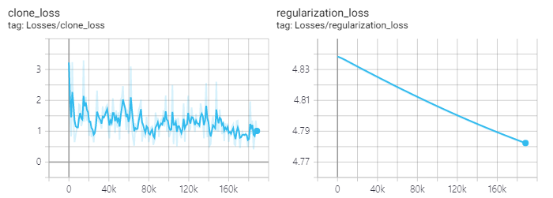

## TODO

1. Implementing BASNet Residual Refinement Module (RRM) in TF1. **[Done]**
2. Implementing BASNet Boundary-aware Hybrid-loss function in TF1. **[Ongoing]**
3. Testing the model to achieve the performance improvement.
    
    3-1. Connecting RRM to DeepLab v3+ decoder. **[Done]**
    
    3-2. Naïve approach (using original loss function)
    - Adding RRM output into feature list of original DeepLab v3+. **[Done]**
    - Training the modified DeepLab v3+ from the scratch. **[Ongoing]**
    
    3-3. Adding boundary-aware hybrid-loss function to be used in training.
    
    3-4. BASNet approach (using boundary-aware hybrid-loss function of BASNet)
    - Training the modified DeepLab v3+ from the scratch with hybrid-loss function.
    - Selecting features for achieving the performance improvement....

## Progress

### 3-2. Naïve approach (using original loss function)

#### Modified Structure

RRM input: output of DeepLab v3+ decoder

RRM output: logits

#### Training from scratch

Need more time?

