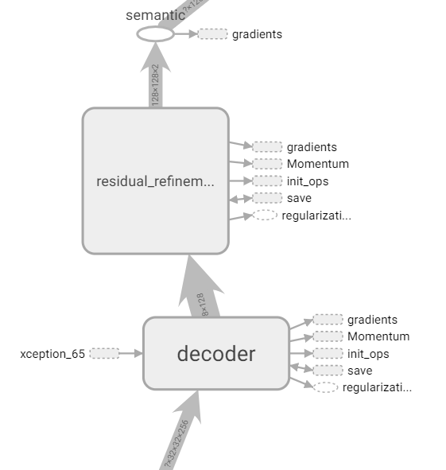

## TODO

1. Implementing BASNet Residual Refinement Module (RRM) in TF1. **[Done]**
2. Implementing BASNet Boundary-aware Hybrid-loss function in TF1. **[Ongoing]**
3. Testing the model to achieve the performance improvement.
    
    3-1. Connecting RRM to DeepLab v3+ decoder. **[Done]**
    
    3-2. Naïve approach (using original loss function)
    - Adding RRM output into feature list of original DeepLab v3+. **[Done]**
    - Training the modified DeepLab v3+ from the scratch. **[Ongoing]**
    
    3-3. Adding boundary-aware hybrid-loss function to be used in training.
    
    3-4. BASNet approach (using boundary-aware hybrid-loss function of BASNet)
    - Training the modified DeepLab v3+ from the scratch with hybrid-loss function.
    - Selecting features for achieving the performance improvement....


## Progress

### 3-2. Naïve approach (using original loss function)

#### Modified Structure



RRM  input: output of DeepLab v3+ decoder

RRM output: logits


#### Training from scratch


Dataset: PASCAL VOC 2012 semantic segmentation dataset.


```bash
python deeplab/train.py \
  --logtostderr \
  --train_split="trainval" \
  --model_variant="xception_65" \
  --atrous_rates=6 \
  --atrous_rates=12 \
  --atrous_rates=18 \
  --output_stride=16 \
  --decoder_output_stride=4 \
  --train_crop_size=512,512 \
  --train_batch_size=4 \
  --training_number_of_steps="500000" \
  --fine_tune_batch_norm=true \
  --train_logdir="/home/jaykim/models/research/deeplab/datasets/pascal_voc_seg/exp/train_on_trainval_set/train_rrm_0114" \
  --dataset_dir="/home/jaykim/models/research/deeplab/datasets/pascal_voc_seg/tfrecord" \
  --decoder_output_is_logits=true
```


Not optimal.. Need more time?

